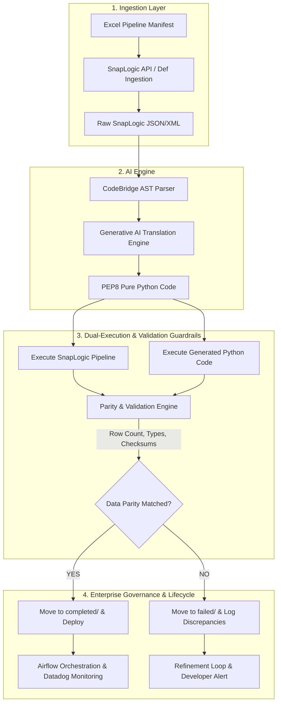

# 🚀 CodeBridge AI: Enterprise SnapLogic-to-Python AI Conversion Platform
## End-to-End Executive & Technical Architecture Blueprint

---

## 1. Executive Summary

**CodeBridge AI** is an enterprise-grade migration platform designed to automatically convert legacy **SnapLogic iPaaS ETL pipelines** into high-performance, cloud-native **Pure Python applications**. Powered by Generative AI and strict output validation guardrails, CodeBridge AI eliminates vendor lock-in, reduces enterprise integration licensing costs by up to 80%, and accelerates migration timelines from months to days.

### Key Value Highlights
- ⚡ **80% Cost Reduction**: Eliminates recurring SnapLogic node subscription and per-task licensing fees.
- 🎯 **Automated Translation**: Converts SnapLogic JSON/XML pipeline logic into standardized, PEP8-compliant Python code.
- ⚖️ **Dual-Execution Validation Engine**: Runs legacy SnapLogic and generated Python side-by-side to guarantee **100% data parity** (row count, column schema, data types, and value checksums).
- 🔓 **Zero Vendor Lock-in**: Code generated is standard Python (Pandas/PySpark/FastAPI) that runs natively on Kubernetes, Docker, AWS, Azure, or GCP.
- 📊 **Audit & Compliance Ready**: Generates automated validation reports (HTML, PDF, JSON) with complete execution logs for enterprise auditors.

---

## 2. Problem Statement

Modern enterprise data architectures are increasingly constrained by legacy iPaaS (Integration Platform as a Service) platforms like SnapLogic. Organizations face severe operational and financial friction:

```
+-----------------------------------------------------------------------------------+
|                            THE LEGACY ETL DILEMMA                                 |
+------------------------------------+----------------------------------------------+
| 1. High Licensing Costs            | Exponential cost scaling as data volume grows|
| 2. Proprietary Vendor Lock-in      | Pipeline logic tied to proprietary Snaps     |
| 3. Execution Overhead & Latency    | Heavy JSON execution engines create overhead  |
| 4. Developer Skill Bottlenecks     | Scarce/expensive SnapLogic certified talent   |
| 5. High Risk of Manual Rewrite     | Human error and regression in manual rewrites|
+------------------------------------+----------------------------------------------+
```

### Detailed Breakdown
1. **Exorbitant Licensing Fees**: SnapLogic subscription tiers scale rapidly based on pipeline volume and active node instances, creating unpredictable cloud budget inflation.
2. **Proprietary Lock-in**: SnapLogic pipelines are stored as complex, vendor-specific JSON graphs containing proprietary "Snaps" (e.g., Mapper, Join, Router, JSON Parser). Migrating away manually requires re-architecting every single pipeline from scratch.
3. **Execution Latency**: Intermediary data transformations inside graphical iPaaS engines incur serialization and memory overhead compared to vectorized Python execution (Pandas / Polars / PySpark).
4. **Scarcity of Niche Skills**: Finding and retaining SnapLogic specialists is challenging, whereas standard Python is the universal language of modern data engineering and AI.
5. **High Risk of Manual Migration**: Manually rewriting hundreds of ETL pipelines creates major regression risks, data corruption risks, and requires months of manual testing.

---

## 3. Proposed Solution: CodeBridge AI

CodeBridge AI bridges the gap between legacy iPaaS platforms and modern Python-based data infrastructure through an **AI-driven, automated conversion and validation pipeline**.



---

## 4. Technology Stack

CodeBridge AI leverages a battle-tested, modular technology stack built for enterprise scalability, security, and low latency:

| Layer | Technology | Version | Purpose & Strategic Rationale |
| :--- | :--- | :--- | :--- |
| **Frontend UI** | React, TypeScript, Vite, Material UI (MUI v6) | React 19, Vite 6 | High-contrast, responsive dashboard with real-time conversion monitoring, data table visualizers, and audit report viewers. |
| **Backend API** | FastAPI, Python, Pydantic | Python 3.12, FastAPI 0.115 | Asynchronous REST backend providing high-throughput API endpoints, automated documentation, and strict input/output validation. |
| **AI Translation** | OpenAI / Azure OpenAI GPT-4o Integration | API v1.57+ | Context-aware LLM engine tuned with structured JSON prompts to accurately map SnapLogic Snaps into pythonic code logic. |
| **Database** | PostgreSQL (Production) / SQLite (Dev) | SQLAlchemy 2.0 Async | Stores user roles, pipeline tracking metadata, conversion history, and execution audit metrics. |
| **Orchestration** | Apache Airflow | Airflow 2.x | Manages batch conversion workflows, automated retries, and scheduled validation jobs. |
| **Telemetry & Logs** | Datadog & Custom Logger | ddtrace / Python Logging | Full APM telemetry, distributed tracing, error tracking, and performance bottleneck diagnostics. |
| **Auth & Security** | Email OTP, JWT Tokens, Bcrypt | Python-Jose / Passlib | Role-Based Access Control (Admin, Developer, Viewer) with secure token validation and password hashing. |
| **Deployment** | Docker, Docker Compose, Render Blueprint | Docker 24+, Render | Containerized deployment supporting 1-click cloud rollout on Kubernetes, AWS, or Render. |

---

## 5. End-to-End Operational Workflow

```
+-----------------------------------------------------------------------------------+
|                         STEP-BY-STEP CONVERSION LIFECYCLE                         |
+-----------------------------------------------------------------------------------+
  [Step 1] LOGIN & AUTHENTICATION
           └─ User authenticates via Email OTP -> Receives JWT Access Token.

  [Step 2] PIPELINE INGESTION
           └─ Developer uploads Excel manifest with SnapLogic pipeline URLs/paths.
           └─ System fetches raw SnapLogic JSON definition via API or storage.

  [Step 3] AI CODE GENERATION
           └─ Parser analyzes pipeline node graph (Snaps, expressions, routes).
           └─ LLM generates clean Python code with logging, exception handling & modular logic.

  [Step 4] DUAL-EXECUTION & PARITY TESTING
           └─ SnapLogic pipeline executes on target environment -> Captures output dataset.
           └─ Generated Python executes in isolated sandbox -> Captures output dataset.

  [Step 5] VALIDATION & REPORTING
           └─ Parity engine validates: Row count, column names, data types, null counts, checksums.
           └─ Generates downloadable audit report (PDF / HTML / JSON).
           └─ Pipeline moved to completed/ or failed/ repository.
+-----------------------------------------------------------------------------------+
```

---

## 6. Business Stakeholder Mindset & Conceptual Framework

> **Goal**: Presenting CodeBridge AI to non-technical business leaders, financial executives, and non-coding stakeholders requires removing technical jargon and focusing on **risk reduction, cost savings, and business agility**.

### 💡 The 4-Step Analogy for Business Users

When explaining CodeBridge AI to business stakeholders, use this simple 4-step real-world analogy:

```
+---------------------------------------------------------------------------------------+
|                       HOW TO EXPLAIN CODEBRIDGE AI TO BUSINESS USERS                   |
+-------------------+-------------------------------------------------------------------+
| Concept           | Business Analogy                                                  |
+-------------------+-------------------------------------------------------------------+
| 1. The Legacy     | "Imagine paying a heavy monthly rent on a proprietary machine     |
|    SnapLogic      | that processes your company's data. If you stop paying rent,      |
|    Pipeline       | you lose access to the machine and all its workflows."            |
+-------------------+-------------------------------------------------------------------+
| 2. CodeBridge AI  | "CodeBridge AI is like an expert master craftsman that looks at   |
|    Translator     | the old machine and builds an exact duplicate in standard Python   |
|                   | code that you own 100% forever with zero rent."                   |
+-------------------+-------------------------------------------------------------------+
| 3. Dual Execution | "Before switching, we run both machines side-by-side on the exact |
|    Validation     | same raw data like a twin-engine plane to prove every single number|
|                   | matches 100% down to the last decimal point."                     |
+-------------------+-------------------------------------------------------------------+
| 4. The Business   | "You cut recurring software license fees, gain complete ownership |
|    Outcome        | of your codebase, and process data faster than before."           |
+-------------------+-------------------------------------------------------------------+
```

### 📈 Business Impact & ROI Matrix

| Business Priority | Traditional Manual Rewrite | CodeBridge AI Solution | Business Impact |
| :--- | :--- | :--- | :--- |
| **Time to Migrate** | 12 - 18 Months | **2 - 4 Weeks** | 85% faster time-to-value |
| **Licensing Cost** | High ongoing subscription | **$0 recurring license** | Up to 80% annual cost savings |
| **Data Integrity Risk** | High risk of human error | **Automated Row/Value Verification** | Zero regression or data corruption |
| **Code Ownership** | Locked in vendor ecosystem | **Open Standard Python** | Total cloud portability & freedom |
| **Maintenance** | Requires niche consultants | **Standard Data Engineering team** | Reduced talent acquisition costs |

---

## 7. Security, Compliance & Governance

- **Data Privacy**: No customer source data is passed to public AI models; code conversion operates strictly on pipeline metadata and JSON definition structures.
- **Role-Based Access Control (RBAC)**:
  - **Admin**: System configuration, user management, global conversion logs.
  - **Developer**: Upload, trigger conversion, run dual validation, view reports.
  - **Viewer**: Read-only access to executive dashboard metrics and parity reports.
- **Audit Trails**: All conversion events, execution timings, user actions, and validation outputs are logged to immutable storage with optional Datadog forwarding.

---

## 8. Conclusion & Next Steps

CodeBridge AI transforms enterprise ETL migration from a risky, multi-year cost center into a fast, automated, and validated modernization strategy. By converting proprietary SnapLogic pipelines into pure Python applications, organizations unlock total code freedom, eliminate licensing fees, and future-proof their data infrastructure.
